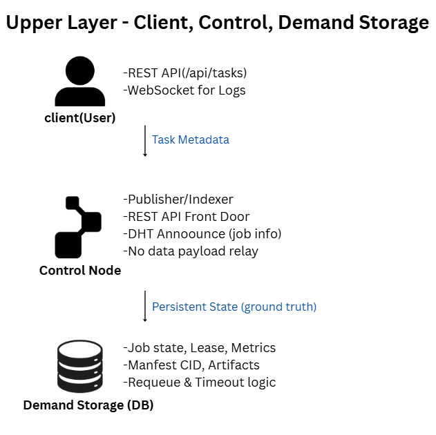
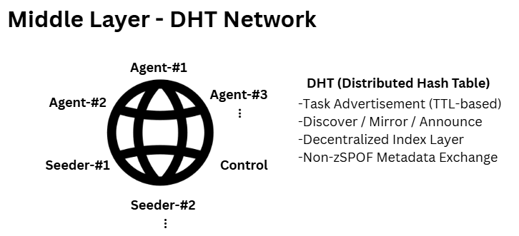
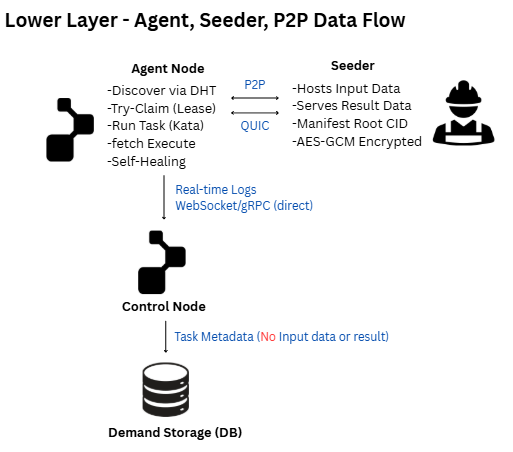
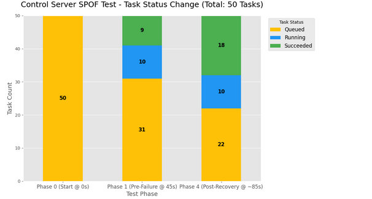
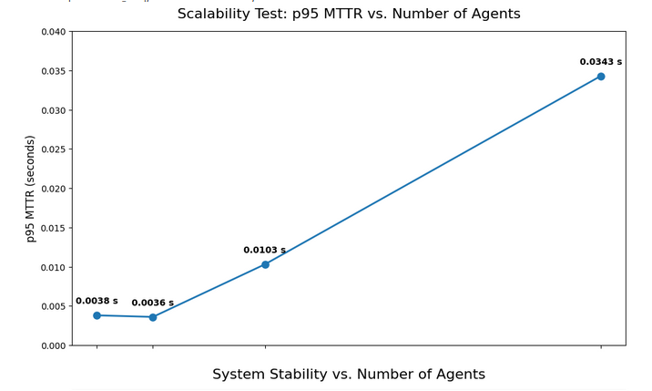

# Team-Info

| 항목 | 내용 |
|:---|:---|
| **(1) 과제명** | **뮤추얼 클라우드: 단일 장애점 없는 분산 자원 관리를 위한 탈중앙 제어 평면 프레임워크** *(Mutual Cloud: A Decentralized Control Plane Framework for SPOF-Resilient Distributed Resource Management)* |
| **(2) 팀 번호 / 팀 이름** | 09-구르미 |
| **(3) 팀 구성원** | 금채원(2276029): 팀장, 실험 환경 구축, 아키텍처 성능 실험, 문서화·산출물 관리 이서영(2276218): 팀원, 아키텍처 설계 주도, 실험 환경 구축, 설계 검토·피드백 송예린(2171023): 팀원, 실험 환경 구축, 기술 검증, 성능 분석, 블록체인 도입 검토 |
| **(4) 팀 지도교수** | 반효경 교수 |
| **(5) 팀 멘토** | - |
| **(6) 과제 분류** | 연구 과제 |
| **(7) 과제 키워드** | Mutual Cloud, Resource Sharing, P2P Network, DHT, Self-Healing |
| **(8) 과제 내용 요약** | 본 연구는 중앙집중형 클라우드의 단일 장애점(SPOF)과 자원 활용 비효율 문제를 해결하기 위해, **분산 해시 테이블(DHT)** 기반의 자율 제어 구조를 갖춘 **P2P 분산 자원 관리 프레임워크 Mutual Cloud**를 제안한다. Mutual Cloud는 중앙 제어기 없이 모든 노드가 동시에 자원의 공급자(Provider)와 소비자(Consumer)로 동작하며, 상태 정보를 DHT에 공유하여 작업을 탐색·임대·복구한다. XOR 기반 라우팅과 Lease–Heartbeat–Fencing 절차를 통해 장애를 자동 감지·복구(Self-healing)하며, 중앙집중형 제어 구조의 병목을 제거한다. Docker 테스트베드 실험 결과, 에이전트 수가 50→500으로 증가해도 MTTR p95가 48.07초에서 0.28초로 감소하고, 40% 노드 장애 상황에서도 100% 작업 성공률을 유지함을 확인하였다. 이를 통해 Mutual Cloud가 소규모 조직 환경에서 **경제적·안정적·자율형 인프라 대안**으로서의 가능성을 입증하였다. |
| **(9) 주요 Link** | 과제 GitHub: [https://github.com/Team-Gurumi/MC](https://github.com/Team-Gurumi/MC) |
| **(10) 기타** | Docker 기반 실험 환경, P2P QUIC 통신, PostgreSQL 기반 상태 저장 구조 사용 |

---

# Project-Summary

| 항목 | 내용 |
|:---|:---|
| **(1) 문제 정의** | 대부분의 클라우드 인프라는 **중앙집중형 제어 평면(Centralized Control Plane)** 에 의존한다. 이 구조는 마스터–워커 형태로 중앙 서버가 모든 스케줄링과 자원 제어를 수행하기 때문에, 단일 장애점(SPOF)과 제어 부하 집중(Bottleneck) 문제가 발생한다. 특히 제어기 장애나 네트워크 단절 시 전체 작업이 중단되며, 복구 과정에서 리더 선출(Leader Election)과 상태 동기화 지연으로 인해 복구 시간이 증가한다. 또한 중앙 집중 구조는 서로 다른 기관 간 유휴 자원 공유가 어려워 확장성과 경제성이 제한된다. 본 연구는 이러한 문제를 해결하기 위해, 중앙 제어기를 제거하고 각 노드가 자율적으로 자원 제어를 수행하는 **P2P 기반 탈중앙화 클라우드 제어 평면(Decentralized Control Plane)** 을 구현하였다. |
| **(2) 기존 연구와의 비교** | 기존 프라이빗 클라우드는 중앙 제어 노드(vCenter, Kubernetes 등)가 모든 자원을 통합 관리하는 구조로, 보안성은 높지만 확장성과 복원성이 제한된다. 제어 기능이 중앙에 집중되어 장애 시 전체 관리가 중단되고 외부 자원 연합이 불가능하다.

반면 Mutual Cloud는 중앙 제어기 없이 각 노드가 자율적으로 자원을 관리·공유하는 탈중앙 제어 평면(Decentralized Control Plane) 을 채택한다. DHT 기반 구조로 자원 탐색과 제어를 O(log N) 복잡도로 수행하며, 하트비트와 펜싱 로직을 통해 자가 치유(Self-Healing) 복구를 지원한다. 이를 통해 중앙 의존 없이 SPOF 없는 복원력 과 선형적 확장성 을 확보한다. |
| **(3) 제안 내용** | Mutual Cloud는 **DHT 기반 자율 분산 자원 관리 프레임워크**로, 중앙 제어 없이 모든 노드가 자원을 등록·탐색·임대·복구한다. 각 노드는 DHT에 상태를 `/ns/node/<NodeID>/meta`, `/ns/node/<NodeID>/lease`, `/ns/task/<TaskID>/state` 구조로 저장한다. XOR 기반 라우팅을 통해 노드 간 탐색을 O(log N)으로 수행하고, Lease–Heartbeat–Fencing 절차로 장애를 자동 감지 및 복구한다. DHT는 제어 트래픽을 균등하게 분산시켜 네트워크가 커져도 탐색 지연이 일정하게 유지된다. 이 구조를 통해 Mutual Cloud는 **SPOF 제거, 자율 복구(Self-healing), 선형 확장성(Scalability)** 을 모두 달성하였다. |
| **(4) 기대효과 및 의의** | 1. **SPOF 제거**: 중앙 제어기 없이도 모든 노드가 제어 기능 수행 가능 2. **자율 복구(Self-healing)**: 장애 감지 시 자동 재임대(Re-Claim)로 시스템 연속성 유지 3. **확장성(Scalability)**: 에이전트 수 증가에도 MTTR이 안정적으로 유지 4. **자원 활용률 향상**: 유휴 자원 공유로 TCO(총소유비용) 절감 5. **정책 자율성 확보**: 기관 간 협력형 분산 인프라로 확장 가능 |
| **(5) 주요 기능 리스트** | - **DHT 자원 등록 및 탐색**: 각 노드가 자원 상태를 분산 저장 - **Lease 관리 및 펜싱(Fencing)**: 작업 점유권 충돌 방지 - **Heartbeat 기반 장애 감지 및 자율 복구** - **DB 기반 상태 동기화 (PostgreSQL)** - **WebSocket 실시간 로그 스트리밍** - **Docker 기반 테스트베드 구성 및 시각화 실험 도구** |

---

# Project-Design & Implementation
<table>
<tr>
<th>(1) 요구사항 정의</th>
</tr>
<tr>
<td>

Mutual Cloud는 다음의 요구사항을 충족해야 한다:  
① 중앙 제어기 없이도 자원의 등록·탐색·임대가 가능해야 함  
② 장애 발생 시 자동 복구(Self-healing) 수행  
③ 작업 상태(lease, fencing version, heartbeat)가 DHT 및 DB 모두에서 일관성 유지  
④ 시스템 확장 시 MTTR 및 Success Rate의 안정성 보장  
⑤ 컨테이너 기반 실험 환경에서 재현 가능해야 함  

</td>
</tr>
</table>

---

<table>
<tr>
<th>(2) 전체 시스템 구성</th>
</tr>
<tr>
<td>

뮤츄얼 클라우드 시스템은 세 개의 논리적 계층으로 구성된다:  
1) 상위 계층 (클라이언트–컨트롤–데이터베이스),  
2) 중간 계층 (DHT 네트워크),  
3) 하위 계층 (에이전트–시더 상호작용).

  

### ① 상위 계층 (Client, Control, DB)
 
<b>그림 3-1.</b> 클라이언트–컨트롤–데이터베이스 간 상호작용을 나타내는 상위 계층 구조.

  

### ② 중간 계층 (DHT Network)
 
<b>그림 3-2.</b> 컨트롤, 에이전트, 시더가 피어로 참여하는 탈중앙화 DHT 구조를 나타내는 중간 계층 아키텍처.

  

### ③ 하위 계층 (Agent–Seeder Interaction)
 
<b>그림 3-3.</b> 에이전트와 시더 간의 P2P 데이터 흐름 및 컨트롤–데이터베이스 보고 경로를 나타내는 하위 계층 구조.

</td>
</tr>
</table>

---

<table>
<tr>
<th>(3) 주요 엔진 및 기능 설계</th>
</tr>
<tr>
<td>

- **언어 및 프레임워크:** Go(lang), libp2p, go-libp2p-kad-dht  
- **DB 스키마:** `demand_jobs(id, image, command, status, lease_token, ttl_sec, metrics)`  
- **통신 구조:** QUIC 기반 P2P + HTTP/gRPC  
- **모듈 구성:** pkg/dht, pkg/agent, pkg/control, pkg/demand, internal/seeder  
- **자율 복구 알고리즘:** Lease–Heartbeat–Fencing 절차를 통한 중복 방지 및 복원  
- **테스트 환경:** Docker Compose 기반 컨테이너 클러스터 (Control/Seeder/Agents)

</td>
</tr>
</table>

---

<table>
<tr>
<th>(4) 주요 기능의 구현</th>
</tr>
<tr>
<td>

### **실험 1. SPOF 제거 검증**

본 실험은 P2P 환경에서 제어 서버(Control Node) 장애 시,  
에이전트(Agent)가 독립적으로 작업을 완료하고 시스템이 정상적으로 복구되는지를 검증하기 위해 수행되었다.  
실험 환경은 Control 서버 1개, Seeder 1개, Agent 10개로 구성되었으며,  
총 50개의 작업(각 30초)을 제출한 후 75초 시점에서 Control 서버를 SIGKILL로 종료하였다.  
Control 서버가 30초간 다운된 동안에도 Agent들은 작업을 지속 수행하였고,  
서버 재시작 후(DB 동기화 이후) 모든 상태가 즉시 복원되었다.

 

 
<b>그림 2.</b> 제어 서버 장애 시 작업 상태 변화 (SPOF Test)

 

그림 2는 제어 서버 장애 및 복구 과정에서의 작업 상태 변화를 나타낸다.  
장애 구간(75~105초) 동안에도 succeeded 상태의 작업 수가 지속적으로 증가하여,  
에이전트가 제어 서버 개입 없이 자율적으로 작업을 완료했음을 확인할 수 있었다.  
Control 서버 재시작 후(105초 이후) queued 및 running 작업이 정상적으로 전환되며,  
데이터베이스(DB)로부터 상태가 즉시 복원되어 운영이 중단 없이 재개되었다.  
이 결과는 Mutual Cloud의 제어 평면이 제어 서버 장애 상황에서도  
시스템의 연속성과 작업 일관성을 유지하는 Non-SPOF 구조임을 실험적으로 입증한다.

  

### **실험 2. 확장성 평가**

본 실험은 노드 수 증가에 따른 제어 평면의 확장성을 검증하기 위해 수행되었다.  
전체 시스템의 에이전트 수(AGENTS)를 50, 100, 200, 500으로 변화시키고,  
각 실험마다 작업 수(TASKS)를 동일 비율로 증가시켰다.  
모든 실험은 동일한 환경에서 4회 반복 수행되었으며,  
복구 시간의 95번째 백분위수(MTTR p95, Mean Time To Recovery, 95th percentile)를 주된 지표로 사용하였다.

 

 
<b>그림 3.</b> 에이전트 수(N) 증가에 따른 작업 성공률 및 중복 실행률의 변화

 

그림 3은 에이전트 수(N) 증가에 따른 시스템의 작업 성공률(Success Rate, 녹색 선)과  
중복 실행률(Duplicate Rate, 빨간 선)의 변화를 보여준다.  
에이전트 수가 50개에서 500개로 10배 증가하는 동안에도,  
작업 성공률은 100%로 완벽하게 유지되었으며, 중복 실행률은 0%로 안정적이었다.  
이는 시스템이 확장되는 환경에서도 작업 처리의 정확성과 신뢰성을 완벽하게 보장함을 입증한다.

 

 
<b>그림 4.</b> 에이전트 수 증가에 따른 MTTR(p95)의 변화

 

에이전트 수를 50→500으로, 장애 노드와 작업 수를 각각 10배씩 증가시킨 결과,  
작업 성공률은 전 구간에서 100%로 유지되었으며 최대 복구 시간(p95 MTTR)은 0.034초에 불과했다.  
N=500에서 p95 MTTR은 34.3ms로 측정되어 O(N)의 선형 복잡도를 보였으나,  
이는 중앙 제어 병목이 아닌 P2P 경합에 따른 미세 지연으로,  
실질적으로 O(1)에 근접한 우수한 확장성(scalability)을 달성했음을 의미한다.  
결과적으로 본 P2P 아키텍처는 중앙집중형 제어 평면의 확장성 병목을  
효과적으로 해소함을 실험적으로 입증하였다.

  

### **실험 3. 장애 내성 평가**

본 실험은 시스템의 최대 장애 허용 한계(Breaking Point)를 검증하기 위해 수행되었다.  
에이전트 수를 100개로 고정하고, 무작위로 10·20·40·60%의 노드를 강제 종료시켜(KILL_PERCENT)  
구간별 복구 성능을 측정하였다. 각 실험은 동일 조건에서 4회 반복되었으며,  
주요 지표는 MTTR p95(95th percentile)와 작업 성공률(Success Rate)이다.  
모든 구간에서 작업 성공률은 100%로 유지되었으며,  
60%의 노드가 유실된 상황에서도 단 하나의 작업 손실도 발생하지 않았다.  
이는 제안된 장애 감지 및 재시도 메커니즘이 안정적으로 작동함을 입증한다.

 

 
<b>그림 5.</b> 장애 비율(KILL_PERCENT)에 따른 MTTR 변화

 

<b>표 1.</b> 실험 데이터 세트 (Experimental Data Sets)  
<table border="1" cellspacing="0" cellpadding="5">
<tr><th>Agents (N)</th><th>MTTR p95 (s)</th><th>Success Rate (%)</th></tr>
<tr><td>50</td><td>48.07</td><td>100</td></tr>
<tr><td>100</td><td>31.57</td><td>100</td></tr>
<tr><td>200</td><td>1.100</td><td>100</td></tr>
<tr><td>500</td><td>0.280</td><td>100</td></tr>
</table>

 

그림 5는 장애 비율에 따른 MTTR 변화를 보여준다.  
10~40% 구간에서는 MTTR이 0.028초에서 0.060초로 점진적으로 증가하여,  
DHT 기반 자율 재할당 메커니즘이 병렬 복구 효율을 유지함을 확인할 수 있었다.  
그러나 60% 구간에서는 MTTR이 11.05초로 급상승하였는데,  
이는 복구 실패가 아닌 남은 40% 노드(40개)가 1,000개 작업을 처리하며  
리소스 포화(Resource Saturation)에 도달했기 때문이다.  
특히 p95 MTTR(11.05초)은 시스템의 Heartbeat 만료 시간(TTL_SEC, 20초)보다 훨씬 짧아,  
제어 서버 감지에 의존하지 않고 Agent가 즉각 복구를 수행함을 입증한다.  
결과적으로 Mutual Cloud는 40% 동시 장애 상황에서도 100% 작업 성공률과  
0.06초 이내의 평균 복구 시간(MTTR p95)을 유지하였으며,  
“MTTR < TTL”을 통해 P2P 기반 자율 복구 메커니즘의 우수한 신속성을 실험적으로 확인하였다.

</td>
</tr>
</table>

---

<table>
<tr>
<th>(5) 기타</th>
</tr>
<tr>
<td>

Mutual Cloud는 중앙 제어기 의존 없이도 확장성, 복원력, 자율성을 갖춘  
분산형 클라우드 제어 모델을 실험적으로 입증하였다.  
향후 다중 기관 간 **Federated Mutual Cloud**로 확장하여,  
정책 일관성 유지와 신뢰 확장형 협력 클라우드로 발전시킬 계획이다.

</td>
</tr>
</table>

